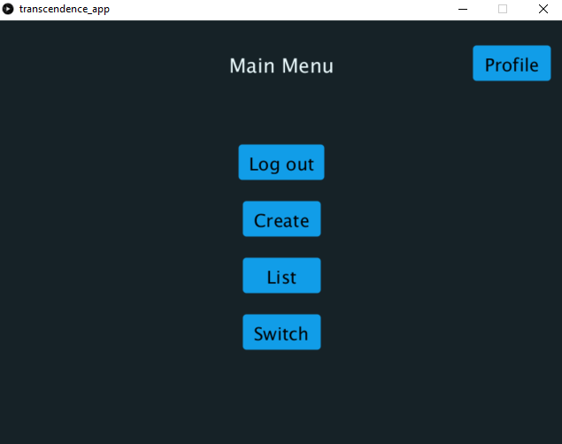
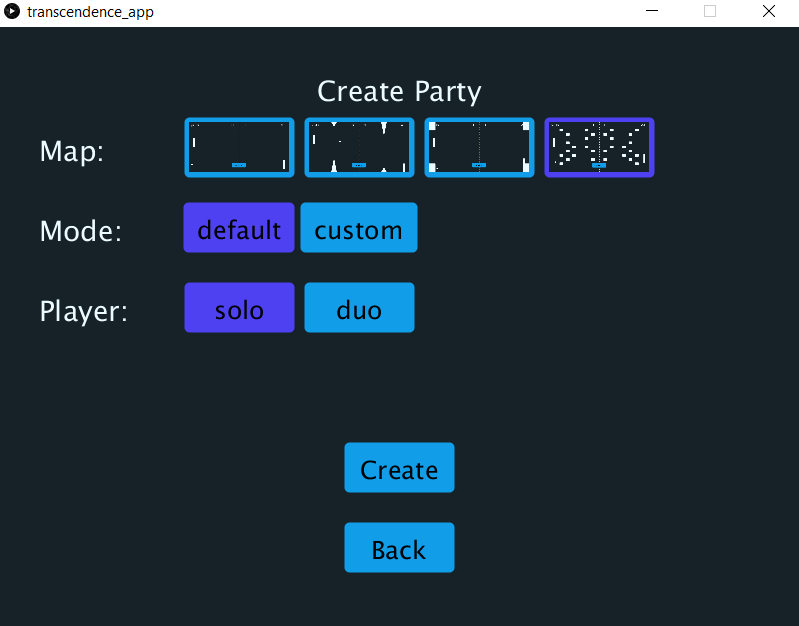
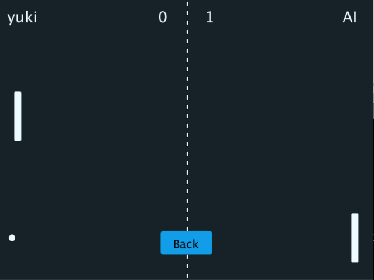

<h1 align="center">
🎮 transcendence_app | PDE
</h1>

## 📝 Table of contents
- [Table of contents](#-table-of-contents)
- [About the project](#-about-the-project)
- [Getting started](#-getting-started)
  - [Prerequisites](#prerequisites)
  - [Installation](#installation)
- [Usage](#-usage)
- [Authors](#-authors)
- [License](#-license)

## 💡 About the project
This project is a multiplayer game application developed in Processing (PDE), designed as a companion app for [ft_transcendence](https://github.com/stanislas1200/ft_transcendence).

## 🏁 Getting started
### Prerequisites
- Processing 3.5.4

### Installation
1. Clone the repository
```sh
git clone https://github.com/yourusername/transcendence_app.git
```
2. Open `transcendence_app.pde` in Processing IDE.

### 📖 Usage
- Run `transcendence_app.pde` in Processing IDE to start the application.
- Navigate through the main menu to access different features and game modes.





### 👤 Authors
- [**Godin Stanislas**](https://github.com/stanislas1200) - *Developer*

### 📜 License
This project is licensed under the MIT License - see the [LICENSE](LICENSE) file for details.
